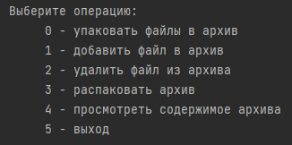
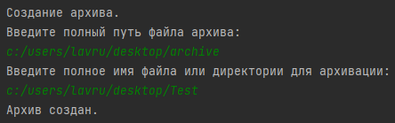
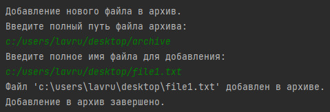
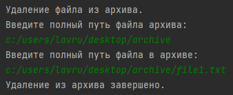
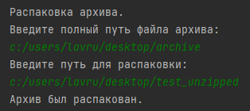
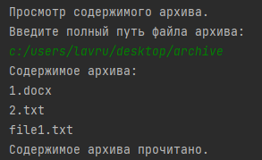
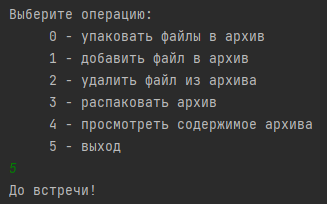

<h1 align="center">Archiver</h1>

---

Console archiver.      
Use numbers to navigate into the program.       

## Functions

### 1. Archive files

1. Enter the path to create archive.        
2. Enter the path to files to archive.    

### 2. Add file to existing archive:

1. Enter the path to existing archive.        
2. Enter the path to the file to add to archive.        

### 3. Delete file from archive:

1. Enter the path to existing archive.        
2. Enter the path to the file to delete from archive.        

### 4. Unzip archive:

1. Enter the path to existing archive.
2. Enter the path to unzip archive.           

### 5. View the contents of the archive:

To check the content of the existing archive enter the path to the archive.     

### 6. Exit:

Enter 5 to terminate the program.     

